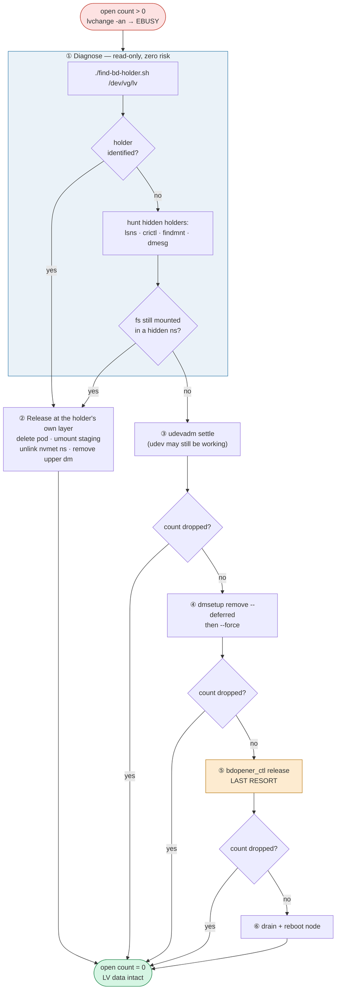
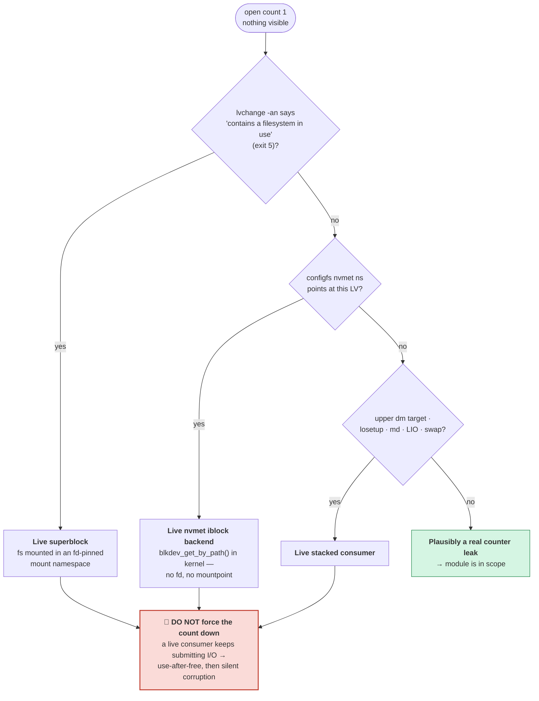
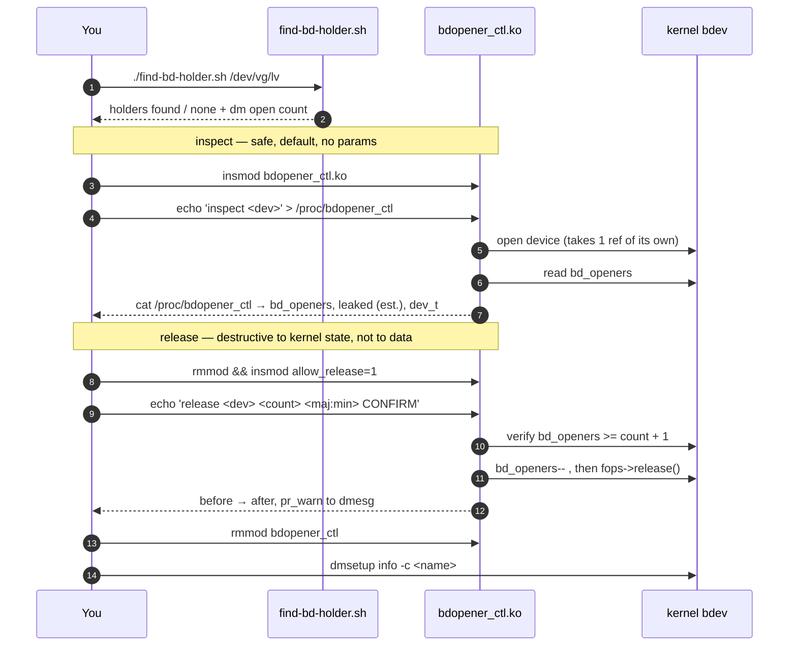
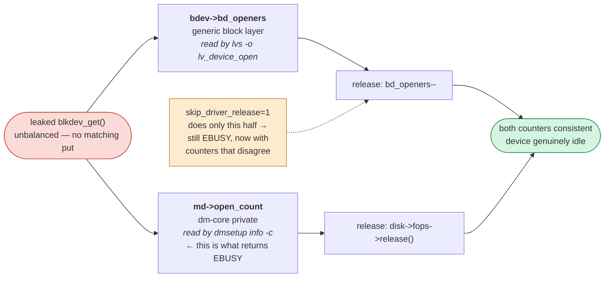
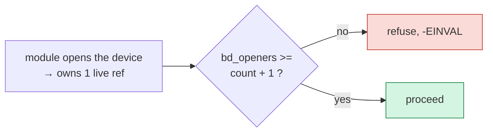

# bdopener_ctl

Inspect and forcibly release **leaked `bd_openers` references** on a live block
device — so a stuck LV becomes deactivatable again **without destroying it**.

> ### Scope: this tool never touches LV data
>
> The goal is to drop a *phantom open count*, nothing else.
>
> | | |
> |---|---|
> | **Does** | read `bd_openers`, decrement it, replay `fops->release()` |
> | **Does not** | write to the LV, wipe signatures, `lvremove`, `lvreduce`, `mkfs`, or `dd` |
>
> No command in this README removes a logical volume. After a successful
> release the LV is still fully intact — you simply get a working
> `lvchange -an` / `dmsetup remove` (mapping teardown only) instead of `EBUSY`.

Built for: an LVM LV backing a Kubernetes PVC (nvmeof + sanlock + lvmlockd +
wdmd) that reports open count 1 with **no *visible* mountpoint or process**, so
`lvchange -an` and `dmsetup remove` fail with `EBUSY` indefinitely.

"No visible mountpoint" is frequently a false negative — the fs can be mounted
in an fd-pinned mount namespace that no live process exposes. Read
[Before you build](#before-you-build) before concluding the reference is truly
leaked.

| File | Role |
|------|------|
| `find-bd-holder.sh` | read-only diagnostic — **run this first** |
| `bdopener_ctl.c` | kernel module: inspect + forced release |
| `Makefile` | build / load / probe |

---

## The whole flow at a glance



Every step is strictly safer than the one below it. **Do not skip steps** — the
module at ⑤ is the only one that can corrupt kernel state.

---

## Before you build

Your symptom — **open count 1, no visible mountpoint or process** — is the
signature of *some* live kernel-side reference, but that reference is **not
always in kernel context**. Decide which case you are in before arming
anything:



### Case A — hidden mount namespace (most common on a k8s node)

An fd-pinned namespace (a leaked `containerd-shim`/kubelet reference, or a pod
whose teardown is still in progress) keeps the mount alive, so **no
`/proc/<pid>/mountinfo` mentions it**. `lvchange -an` then fails with
`Logical volume ... contains a filesystem in use` (exit status 5) — that is a
live superblock, not a counter leak.

This is the case `find-bd-holder.sh`'s own verdict text describes: *"if the
opener has since exited, no visible process."* In practice the opener usually
**hasn't** exited — it's in a hidden namespace.

Prove whether the filesystem really is unmounted:

```bash
lsns -t mnt                                   # NPROCS=0 with a holder PID = fd-pinned
crictl ps -a | grep <pod-uid>                 # container still holding the volume?
findmnt -rn | grep -iE '<lv-name>|253:11'     # incl. CSI staging mounts
dmesg | grep -E 'XFS.*(Mounting|Unmounting)'
# "Mounting V5 Filesystem" + "Ending clean mount" with NO following
# "Unmounting Filesystem" = the fs is still mounted somewhere.
```

### Case B — `nvmet` kernel-context holder

If the fs truly is gone, the classic kernel-context holder is **`nvmet`**: the
NVMe target's `iblock` backend calls `blkdev_get_by_path()` in the kernel, so
there is no fd for `lsof`/`fuser` to report and no mountpoint to unmount. If a
`configfs` namespace still points at that LV — commonly one left with
`enable=0` but never `rmdir`'d, or one whose PVC was deleted out from under it
— the reference is **real, correct, and permanent** until you unlink it:

```bash
grep -r . /sys/kernel/config/nvmet/subsystems/*/namespaces/*/device_path
# find the namespace pointing at your LV, then:
echo 0 > /sys/kernel/config/nvmet/subsystems/<subsys>/namespaces/<nsid>/enable
rmdir   /sys/kernel/config/nvmet/subsystems/<subsys>/namespaces/<nsid>
```

Unlinking the namespace does not modify the LV's contents.

### What the diagnostic covers — and its two blind spots

`find-bd-holder.sh` checks all of the above: a `rdev`/`st_dev`-matched scan of
every `/proc/*/{fd,maps,cwd,root,exe}`, a per-process `mountinfo` scan, and an
fd-pinned-namespace probe. Two limits before trusting an "all clean":

- the fd-pinned probe shells out to `nsenter` and is **silently blind if
  `nsenter` is not installed**;
- the fd/`st_dev` scan reads device numbers via `stat -c '%R %d'` (falling back
  to `%t %T`); on hosts whose `stat` cannot emit those, it reports paths as
  **skipped** rather than matched.

---

## Escalation order

| # | Action | Risk | Touches LV data? |
|---|--------|------|------------------|
| 1 | `./find-bd-holder.sh /dev/csi-lvm/pvc-...` | none, read-only | no |
| 2 | Hunt hidden holders step 1 can miss: `lsns`, `crictl ps -a`, `findmnt -A`, CSI staging paths, the dmesg unmount check | none, read-only | no |
| 3 | Release the holder at its own layer: delete the pod/container, umount the staging mount, unlink the nvmet namespace | normal operation | no |
| 4 | `udevadm settle` — udev may simply still be working | none | no |
| 5 | `dmsetup remove --deferred <name>` — tears down the *mapping* once the count drops | low | no |
| 6 | `dmsetup remove --force <name>` — swaps in an error target, then removes the mapping | moderate; in-flight I/O gets `EIO` | no |
| 7 | **this module's `release`** | high; corrupts kernel state if a holder exists | no |
| 8 | Drain + reboot the node | disruptive but always correct | no |

Steps 5 and 6 are the kernel's own supported answers to exactly this problem
and resolve most real leaks. `dmsetup remove` only removes the device-mapper
mapping — the LV's extents and filesystem stay on disk and reappear on the next
`lvchange -ay`.

**Reach step 7 only when 5 and 6 have failed *and* steps 1–2 found nothing.**

---

## Build

```bash
# RHEL/CentOS/Rocky
sudo dnf install -y kernel-devel-$(uname -r) gcc make
# Debian/Ubuntu
sudo apt install -y linux-headers-$(uname -r) build-essential

make probe    # confirm headers exist and show which struct layout was detected
make
```

`make probe` prints where `bd_openers` and `open_mutex` live in your tree. If
the build fails, the version heuristics guessed wrong for your vendor kernel —
set the `-DBDOC_*` overrides in the `Makefile` per the `OVERRIDES` block in the
`.c`.

Building requires headers on the node and, if Secure Boot is on, a signed
module. On an immutable/CoreOS-style host you will need a `kmod-via-container`
build or a pre-built signed `.ko`.

---

## Use



### Inspect (safe — this is the default)

```bash
chmod +x find-bd-holder.sh
sudo ./find-bd-holder.sh /dev/csi-lvm/pvc-4ef0ed25-fbda-448a-a9ad-15ee68b4fd3a

sudo insmod ./bdopener_ctl.ko
echo 'inspect /dev/csi-lvm/pvc-4ef0ed25-fbda-448a-a9ad-15ee68b4fd3a' \
  | sudo tee /proc/bdopener_ctl
sudo cat /proc/bdopener_ctl
```

```text
== inspect /dev/csi-lvm/pvc-4ef0ed25-fbda-448a-a9ad-15ee68b4fd3a ==
dev_t          : 253:11
disk           : dm-11
bd_openers     : 2
  (includes 1 reference held by this module during inspect)
leaked (est.)  : 1
lock in use    : bd_disk->open_mutex
driver release : present
```

Note `leaked (est.) : 1` — the module holds one reference of its own while
looking, so `bd_openers` reads one higher than what LVM reports.

### Release (destructive to kernel state — LV data untouched)

```bash
sudo rmmod bdopener_ctl
sudo insmod ./bdopener_ctl.ko allow_release=1

# count and dev_t must both match what inspect reported
echo 'release /dev/csi-lvm/pvc-4ef0ed25-fbda-448a-a9ad-15ee68b4fd3a 1 253:11 CONFIRM' \
  | sudo tee /proc/bdopener_ctl
sudo cat /proc/bdopener_ctl

sudo rmmod bdopener_ctl
```

Then **verify only** — no removal, no wipe:

```bash
sudo dmsetup info -c csi--lvm-pvc--4ef0ed25--fbda--448a--a9ad--15ee68b4fd3a
sudo lvs -o lv_name,lv_device_open,lv_attr csi-lvm

# the LV is now deactivatable again; data stays on disk either way
sudo lvchange -an /dev/csi-lvm/pvc-4ef0ed25-fbda-448a-a9ad-15ee68b4fd3a
sudo lvchange -ay /dev/csi-lvm/pvc-4ef0ed25-fbda-448a-a9ad-15ee68b4fd3a   # bring it back
```

The explicit `253:11` and the literal `CONFIRM` are mandatory: a stale symlink
under `/dev/csi-lvm/` after a `dmsetup` reshuffle can point somewhere entirely
different, and asserting the `dev_t` you actually inspected makes hitting the
wrong device impossible. Every release is logged at `pr_warn` to `dmesg`.

---

## Why it decrements *and* calls `fops->release`

For a dm device a single leaked `blkdev_get()` inflated **two** counters:



Decrementing only `bd_openers` leaves you just as busy, now with a counter that
disagrees with reality. So `release` replays a **complete `blkdev_put()`**:
decrement, then invoke `disk->fops->release()`, under the same lock the real
put path holds (`bd_disk->open_mutex` on ≥ 5.19, `bdev->bd_mutex` before).

`skip_driver_release=1` exists to decrement only. It is almost never what you
want, and is there for the case where you have already confirmed via
`dmsetup info` that `open_count` is 0 while `bd_openers` is not.

### Underflow is structurally impossible



The module opens the device itself before touching anything, so it always owns
one live reference, and refuses unless `bd_openers >= count + 1`. **Do not
relax that check** — it is the only thing standing between a typo and a
negative refcount.

---

## Caveats

- Uses no exported symbol, but does write a `struct block_device` field
  directly. That is not a stable ABI: **re-verify `make probe` after every
  kernel upgrade.**
- Taints the kernel. Vendor support for that node may be void while loaded.
  Unload as soon as you are done.
- `sanlock`/`lvmlockd` hold the VG's internal `lvmlock` LV open, not your
  per-PVC LVs. A stuck lease shows up in `sanlock client status` /
  `lvmlockctl -i`, **not** as elevated `bd_openers` on a PVC. If deactivation
  fails with a lock error rather than `EBUSY`, this module is the wrong tool —
  look at `lvmlockctl --drop <vgname>`.
- Test on a scratch VG on a non-production node first:
  ```bash
  vgcreate testvg /dev/loop0 && lvcreate -n t -L 32M testvg
  # hold it open from kernel context, then inspect
  ```
- If leaks keep recurring, the module is a bandaid. The real bug is upstream —
  usually a CSI driver whose NodeUnpublish/NodeUnstage tears down the mount but
  leaves the filesystem referenced (a leaked container mount namespace, an
  unremoved staging mount, or an `nvmet` namespace it failed to unlink).
  Capture `find-bd-holder.sh` output plus `dmesg` at leak time and file it
  against the driver.
</content>
</invoke>
